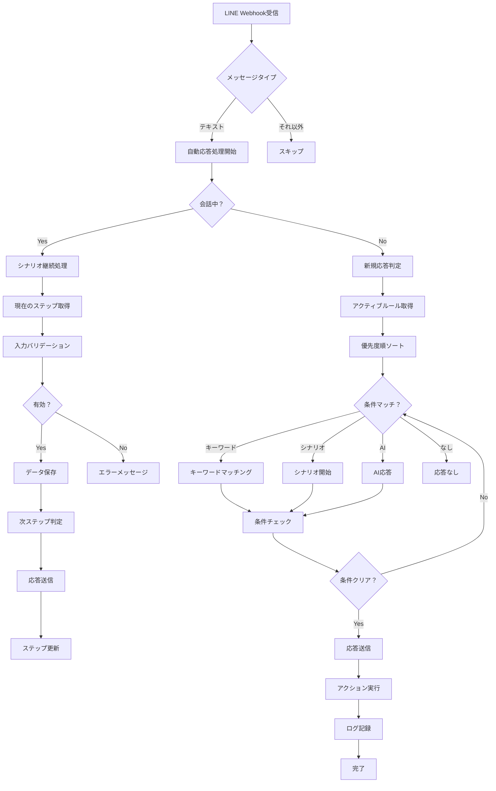

# Phase 7: 自動応答機能 完全実装計画書

**作成日**: 2025-10-30
**対象フェーズ**: Phase 7
**所要期間**: 5-7日
**前提条件**: Phase 1-6完了（友だち管理、メッセージ配信、タグ管理が実装済み）

---

## 目次

1. [概要](#1-概要)
2. [機能仕様](#2-機能仕様)
3. [データベース設計](#3-データベース設計)
4. [画面設計](#4-画面設計)
5. [応答ロジック設計](#5-応答ロジック設計)
6. [API設計](#6-api設計)
7. [Edge Functions設計](#7-edge-functions設計)
8. [AI統合設計](#8-ai統合設計オプション)
9. [実装手順](#9-実装手順)
10. [テストシナリオ](#10-テストシナリオ)

---

## 1. 概要

### 1.1 機能説明

自動応答機能は、LINE友だちからのメッセージを受信した際に、設定したルールに基づいて自動的に応答メッセージを返信する機能です。キーワードマッチング、会話シナリオ、条件分岐、AI応答など、複数の応答パターンをサポートします。

### 1.2 主要機能

#### 1.2.1 キーワード応答
- **完全一致**: 入力メッセージがキーワードと完全に一致した場合に応答
- **部分一致**: 入力メッセージにキーワードが含まれる場合に応答
- **正規表現**: 正規表現パターンでマッチングした場合に応答
- **除外キーワード**: 特定キーワードが含まれる場合は応答しない
- **優先順位**: 複数ルールがマッチした場合の優先度制御

#### 1.2.2 シナリオ応答（会話フロー）
- **ステップ管理**: 複数ステップの会話フローを構築
- **分岐条件**: ユーザー回答に基づく分岐処理
- **状態管理**: 会話状態の保持（進行中、完了、タイムアウト）
- **タイムアウト**: 一定時間経過後の会話リセット
- **ステップ間アクション**: 各ステップでのタグ付与、メッセージ送信など

#### 1.2.3 条件分岐
- **友だち属性**: タグ、セグメント、カスタムフィールドによる条件分岐
- **時間条件**: 時間帯（営業時間内/外）、曜日、期間による出し分け
- **行動条件**: 過去のメッセージ開封、URL クリック、フォーム回答履歴
- **カウント条件**: メッセージ受信回数、特定アクション実行回数

#### 1.2.4 応答タイプ
- **テキスト応答**: シンプルなテキストメッセージ
- **テンプレート応答**: 変数（名前、日付など）を含むテンプレート
- **リッチメッセージ**: Flex Message、カルーセル、画像付きメッセージ
- **アクション実行**: タグ付与、セグメント移動、ステップ配信開始

#### 1.2.5 AI応答（オプション）
- **ChatGPT統合**: OpenAI API連携
- **プロンプト設定**: システムプロンプトとコンテキスト管理
- **会話履歴**: 過去の会話を考慮した応答生成
- **フォールバック**: AI失敗時のデフォルト応答

### 1.3 技術スタック

- **フロントエンド**: Next.js 16 + React 19 + shadcn/ui + Heroicons
- **バックエンド**: Supabase (PostgreSQL + Edge Functions)
- **リアルタイム**: Supabase Realtime (会話状態の同期)
- **AI統合**: OpenAI API (オプション)

---

## 2. 機能仕様

### 2.1 キーワード応答ルール

#### 2.1.1 マッチングタイプ

```typescript
type MatchType =
  | 'exact'        // 完全一致: "こんにちは" === "こんにちは"
  | 'partial'      // 部分一致: "こんにちは" に "こん" が含まれる
  | 'startsWith'   // 前方一致: "こんにちは" で始まる
  | 'endsWith'     // 後方一致: "こんにちは" で終わる
  | 'regex'        // 正規表現: /^こんにちは.*/
```

#### 2.1.2 キーワード設定

| 項目 | 説明 | 例 |
|------|------|-----|
| **キーワード** | マッチング対象の文字列 | "予約", "料金", "営業時間" |
| **マッチタイプ** | マッチング方式 | 完全一致、部分一致、正規表現 |
| **大文字小文字** | 区別するか | 区別しない（デフォルト） |
| **除外キーワード** | これが含まれる場合は除外 | "キャンセル", "不要" |
| **優先度** | 1-100（数字が大きいほど優先） | 10 |

#### 2.1.3 応答メッセージ設定

| 項目 | 説明 |
|------|------|
| **応答タイプ** | テキスト、テンプレート、Flex、アクション |
| **メッセージ内容** | 実際の応答メッセージ |
| **変数** | {name}, {date}, {time} などの動的変数 |
| **アクション** | タグ付与、セグメント追加、ステップ配信開始 |

### 2.2 シナリオ応答（会話フロー）

#### 2.2.1 シナリオ構造

```typescript
interface Scenario {
  id: string
  name: string
  description: string
  trigger: ScenarioTrigger    // 開始条件
  steps: ScenarioStep[]       // ステップ配列
  timeout_minutes: number     // タイムアウト時間（分）
  status: 'active' | 'inactive'
}

interface ScenarioStep {
  id: string
  scenario_id: string
  step_number: number         // ステップ順序
  message: MessageContent     // 送信メッセージ
  expected_input: ExpectedInput  // 期待する入力
  branches: ScenarioBranch[]  // 分岐条件
  actions: StepAction[]       // ステップ実行時のアクション
  next_step_id: string | null // 次のステップ（分岐なしの場合）
}

interface ScenarioBranch {
  id: string
  condition: BranchCondition  // 分岐条件
  next_step_id: string        // 遷移先ステップ
  actions: StepAction[]       // 分岐時のアクション
}
```

#### 2.2.2 シナリオ例：予約受付フロー

```
[ステップ1] トリガー: "予約" キーワード
→ メッセージ: "ご予約を承ります。お名前を教えてください"
→ 期待入力: テキスト（名前）

[ステップ2] 前ステップの回答を取得
→ メッセージ: "{name}様、ご希望の日時を教えてください（例: 12/25 14:00）"
→ 期待入力: 日時形式

[ステップ3] 日時バリデーション
→ 有効な場合: "予約を確定しました"
→ 無効な場合: "日時の形式が正しくありません。もう一度入力してください"（ステップ2に戻る）

[完了] アクション実行
→ タグ付与: "予約完了"
→ 予約データ保存
→ リマインダー設定
```

### 2.3 条件分岐

#### 2.3.1 友だち属性条件

```typescript
interface FriendAttributeCondition {
  type: 'tag' | 'segment' | 'custom_field'
  operator: 'has' | 'not_has' | 'equals' | 'not_equals' | 'contains'
  value: string | string[]
}

// 例
{
  type: 'tag',
  operator: 'has',
  value: ['VIP', 'プレミアム会員']
}
```

#### 2.3.2 時間条件

```typescript
interface TimeCondition {
  type: 'time_range' | 'day_of_week' | 'date_range'

  // 時間帯（例: 営業時間内のみ応答）
  time_range?: {
    start: string  // "09:00"
    end: string    // "18:00"
  }

  // 曜日（例: 平日のみ）
  day_of_week?: number[]  // [1,2,3,4,5] = 月-金

  // 期間（例: キャンペーン期間中）
  date_range?: {
    start: string  // "2025-12-01"
    end: string    // "2025-12-31"
  }
}
```

#### 2.3.3 行動条件

```typescript
interface BehaviorCondition {
  type: 'message_opened' | 'url_clicked' | 'form_submitted' | 'action_count'

  // メッセージ開封条件
  message_opened?: {
    message_id: string
    within_days: number  // 過去N日以内
  }

  // URLクリック条件
  url_clicked?: {
    url_mapping_id: string
    min_clicks: number
  }

  // フォーム回答条件
  form_submitted?: {
    form_id: string
    answer_conditions: Record<string, any>
  }

  // アクション回数条件
  action_count?: {
    action_type: string
    operator: '>=' | '<=' | '=' | '>' | '<'
    count: number
  }
}
```

### 2.4 応答アクション

#### 2.4.1 アクションタイプ

```typescript
type ResponseAction =
  | { type: 'send_message', message: MessageContent }
  | { type: 'add_tag', tag_ids: string[] }
  | { type: 'remove_tag', tag_ids: string[] }
  | { type: 'add_to_segment', segment_id: string }
  | { type: 'start_step_campaign', campaign_id: string }
  | { type: 'trigger_webhook', webhook_url: string, payload: any }
  | { type: 'update_custom_field', field_name: string, value: any }
```

### 2.5 AI応答設定（オプション）

#### 2.5.1 OpenAI統合

```typescript
interface AIResponseSettings {
  enabled: boolean
  model: 'gpt-4' | 'gpt-4-turbo' | 'gpt-3.5-turbo'
  system_prompt: string
  temperature: number  // 0.0 - 1.0
  max_tokens: number
  context_history_count: number  // 過去何件の会話を含めるか
  fallback_message: string  // AI失敗時のメッセージ
  fallback_actions: ResponseAction[]
}
```

#### 2.5.2 プロンプトテンプレート

```typescript
const systemPromptTemplate = `
あなたは{business_name}のLINE公式アカウントのカスタマーサポート担当です。

【基本情報】
- 営業時間: {business_hours}
- 提供サービス: {services}
- よくある質問: {faq}

【対応方針】
- 丁寧で親しみやすい口調で対応してください
- 不明な点は正直に「確認します」と伝えてください
- 営業時間外の場合は翌営業日の対応を案内してください

【友だち情報】
- 名前: {friend_name}
- タグ: {friend_tags}
- 過去の履歴: {friend_history}
`
```

---

## 3. データベース設計

### 3.1 テーブル一覧

```sql
-- 自動応答ルールマスタ
CREATE TABLE auto_response_rules (
  id UUID PRIMARY KEY DEFAULT uuid_generate_v4(),
  user_id UUID NOT NULL REFERENCES users(id) ON DELETE CASCADE,
  name TEXT NOT NULL,
  description TEXT,
  type TEXT NOT NULL, -- 'keyword', 'scenario', 'ai'
  priority INTEGER DEFAULT 10, -- 1-100
  status TEXT DEFAULT 'active', -- 'active', 'inactive', 'draft'
  conditions JSONB DEFAULT '{}', -- 時間条件、友だち属性条件など
  settings JSONB DEFAULT '{}', -- ルール固有の設定
  created_at TIMESTAMPTZ DEFAULT NOW(),
  updated_at TIMESTAMPTZ DEFAULT NOW()
);

-- キーワード定義
CREATE TABLE auto_response_keywords (
  id UUID PRIMARY KEY DEFAULT uuid_generate_v4(),
  rule_id UUID NOT NULL REFERENCES auto_response_rules(id) ON DELETE CASCADE,
  keyword TEXT NOT NULL,
  match_type TEXT DEFAULT 'partial', -- 'exact', 'partial', 'startsWith', 'endsWith', 'regex'
  case_sensitive BOOLEAN DEFAULT false,
  exclude_keywords TEXT[] DEFAULT '{}', -- 除外キーワード配列
  created_at TIMESTAMPTZ DEFAULT NOW()
);

-- シナリオ定義
CREATE TABLE auto_response_scenarios (
  id UUID PRIMARY KEY DEFAULT uuid_generate_v4(),
  rule_id UUID NOT NULL REFERENCES auto_response_rules(id) ON DELETE CASCADE,
  name TEXT NOT NULL,
  description TEXT,
  timeout_minutes INTEGER DEFAULT 30, -- 会話タイムアウト時間
  created_at TIMESTAMPTZ DEFAULT NOW(),
  updated_at TIMESTAMPTZ DEFAULT NOW()
);

-- シナリオステップ
CREATE TABLE auto_response_scenario_steps (
  id UUID PRIMARY KEY DEFAULT uuid_generate_v4(),
  scenario_id UUID NOT NULL REFERENCES auto_response_scenarios(id) ON DELETE CASCADE,
  step_number INTEGER NOT NULL,
  message_type TEXT NOT NULL, -- 'text', 'flex', 'template'
  message_content JSONB NOT NULL,
  expected_input_type TEXT, -- 'text', 'number', 'date', 'choice', 'any'
  validation_rules JSONB DEFAULT '{}', -- バリデーションルール
  branches JSONB DEFAULT '[]', -- 分岐条件配列
  actions JSONB DEFAULT '[]', -- ステップアクション配列
  next_step_id UUID REFERENCES auto_response_scenario_steps(id),
  created_at TIMESTAMPTZ DEFAULT NOW(),
  UNIQUE(scenario_id, step_number)
);

-- 会話状態管理
CREATE TABLE auto_response_conversations (
  id UUID PRIMARY KEY DEFAULT uuid_generate_v4(),
  friend_id UUID NOT NULL REFERENCES friends(id) ON DELETE CASCADE,
  scenario_id UUID NOT NULL REFERENCES auto_response_scenarios(id) ON DELETE CASCADE,
  current_step_id UUID REFERENCES auto_response_scenario_steps(id),
  status TEXT DEFAULT 'in_progress', -- 'in_progress', 'completed', 'timeout', 'cancelled'
  conversation_data JSONB DEFAULT '{}', -- 会話で収集したデータ
  started_at TIMESTAMPTZ DEFAULT NOW(),
  last_interaction_at TIMESTAMPTZ DEFAULT NOW(),
  completed_at TIMESTAMPTZ,
  created_at TIMESTAMPTZ DEFAULT NOW()
);

-- 応答ログ
CREATE TABLE auto_response_logs (
  id UUID PRIMARY KEY DEFAULT uuid_generate_v4(),
  friend_id UUID NOT NULL REFERENCES friends(id) ON DELETE CASCADE,
  rule_id UUID REFERENCES auto_response_rules(id) ON DELETE SET NULL,
  scenario_id UUID REFERENCES auto_response_scenarios(id) ON DELETE SET NULL,
  trigger_message TEXT NOT NULL, -- 受信したメッセージ
  response_type TEXT NOT NULL, -- 'keyword', 'scenario', 'ai', 'none'
  response_sent BOOLEAN DEFAULT true,
  response_content JSONB, -- 送信した応答内容
  processing_time_ms INTEGER, -- 処理時間（ミリ秒）
  error_message TEXT,
  created_at TIMESTAMPTZ DEFAULT NOW()
);

-- AI応答設定（オプション）
CREATE TABLE auto_response_ai_settings (
  id UUID PRIMARY KEY DEFAULT uuid_generate_v4(),
  user_id UUID NOT NULL REFERENCES users(id) ON DELETE CASCADE,
  enabled BOOLEAN DEFAULT false,
  openai_api_key TEXT, -- 暗号化推奨
  model TEXT DEFAULT 'gpt-3.5-turbo',
  system_prompt TEXT,
  temperature DECIMAL(2,1) DEFAULT 0.7,
  max_tokens INTEGER DEFAULT 500,
  context_history_count INTEGER DEFAULT 5,
  fallback_message TEXT,
  created_at TIMESTAMPTZ DEFAULT NOW(),
  updated_at TIMESTAMPTZ DEFAULT NOW(),
  UNIQUE(user_id)
);

-- AI会話履歴
CREATE TABLE auto_response_ai_conversations (
  id UUID PRIMARY KEY DEFAULT uuid_generate_v4(),
  friend_id UUID NOT NULL REFERENCES friends(id) ON DELETE CASCADE,
  role TEXT NOT NULL, -- 'user', 'assistant', 'system'
  content TEXT NOT NULL,
  tokens_used INTEGER,
  created_at TIMESTAMPTZ DEFAULT NOW()
);
```

### 3.2 インデックス

```sql
-- パフォーマンス最適化用インデックス
CREATE INDEX idx_auto_response_rules_user_status ON auto_response_rules(user_id, status);
CREATE INDEX idx_auto_response_rules_type_priority ON auto_response_rules(type, priority DESC);
CREATE INDEX idx_auto_response_keywords_rule ON auto_response_keywords(rule_id);
CREATE INDEX idx_auto_response_keywords_keyword ON auto_response_keywords(keyword);
CREATE INDEX idx_auto_response_scenarios_rule ON auto_response_scenarios(rule_id);
CREATE INDEX idx_auto_response_scenario_steps_scenario ON auto_response_scenario_steps(scenario_id, step_number);
CREATE INDEX idx_auto_response_conversations_friend_status ON auto_response_conversations(friend_id, status);
CREATE INDEX idx_auto_response_conversations_scenario ON auto_response_conversations(scenario_id, status);
CREATE INDEX idx_auto_response_logs_friend ON auto_response_logs(friend_id, created_at DESC);
CREATE INDEX idx_auto_response_logs_rule ON auto_response_logs(rule_id, created_at DESC);
CREATE INDEX idx_auto_response_ai_conversations_friend ON auto_response_ai_conversations(friend_id, created_at DESC);
```

### 3.3 RLS (Row Level Security)

```sql
-- 自動応答ルール
ALTER TABLE auto_response_rules ENABLE ROW LEVEL SECURITY;

CREATE POLICY "Users can manage own auto response rules"
ON auto_response_rules FOR ALL
USING (user_id = auth.uid());

-- キーワード
ALTER TABLE auto_response_keywords ENABLE ROW LEVEL SECURITY;

CREATE POLICY "Users can manage own keywords"
ON auto_response_keywords FOR ALL
USING (
  rule_id IN (
    SELECT id FROM auto_response_rules WHERE user_id = auth.uid()
  )
);

-- シナリオ
ALTER TABLE auto_response_scenarios ENABLE ROW LEVEL SECURITY;

CREATE POLICY "Users can manage own scenarios"
ON auto_response_scenarios FOR ALL
USING (
  rule_id IN (
    SELECT id FROM auto_response_rules WHERE user_id = auth.uid()
  )
);

-- ステップ
ALTER TABLE auto_response_scenario_steps ENABLE ROW LEVEL SECURITY;

CREATE POLICY "Users can manage own scenario steps"
ON auto_response_scenario_steps FOR ALL
USING (
  scenario_id IN (
    SELECT s.id FROM auto_response_scenarios s
    JOIN auto_response_rules r ON s.rule_id = r.id
    WHERE r.user_id = auth.uid()
  )
);

-- 会話状態
ALTER TABLE auto_response_conversations ENABLE ROW LEVEL SECURITY;

CREATE POLICY "Users can view own conversations"
ON auto_response_conversations FOR SELECT
USING (
  friend_id IN (
    SELECT id FROM friends WHERE user_id = auth.uid()
  )
);

-- ログ
ALTER TABLE auto_response_logs ENABLE ROW LEVEL SECURITY;

CREATE POLICY "Users can view own logs"
ON auto_response_logs FOR SELECT
USING (
  friend_id IN (
    SELECT id FROM friends WHERE user_id = auth.uid()
  )
);

-- AI設定
ALTER TABLE auto_response_ai_settings ENABLE ROW LEVEL SECURITY;

CREATE POLICY "Users can manage own AI settings"
ON auto_response_ai_settings FOR ALL
USING (user_id = auth.uid());

-- AI会話履歴
ALTER TABLE auto_response_ai_conversations ENABLE ROW LEVEL SECURITY;

CREATE POLICY "Users can view own AI conversations"
ON auto_response_ai_conversations FOR SELECT
USING (
  friend_id IN (
    SELECT id FROM friends WHERE user_id = auth.uid()
  )
);
```

---

## 4. 画面設計

### 4.1 自動応答一覧画面

**パス**: `/dashboard/auto-response`

#### 4.1.1 レイアウト

```
┌─────────────────────────────────────────────────────────────┐
│ 自動応答                                    [+ 新規作成]     │
├─────────────────────────────────────────────────────────────┤
│ [すべて] [キーワード] [シナリオ] [AI]          🔍 検索      │
├─────────────────────────────────────────────────────────────┤
│                                                             │
│ ┌───────────────────────────────────────────────────────┐  │
│ │ ✓ よくある質問 - 営業時間                     優先度: 8│  │
│ │   キーワード: 営業時間, 営業, 何時まで              │  │
│ │   応答: テキストメッセージ                  [編集] [削除]│  │
│ └───────────────────────────────────────────────────────┘  │
│                                                             │
│ ┌───────────────────────────────────────────────────────┐  │
│ │ ✓ 予約受付フロー                          優先度: 10  │  │
│ │   シナリオ: 5ステップ                                 │  │
│ │   トリガー: "予約", "予約したい"            [編集] [削除]│  │
│ └───────────────────────────────────────────────────────┘  │
│                                                             │
│ ┌───────────────────────────────────────────────────────┐  │
│ │ ⚠ AI応答（未設定）                        優先度: 5   │  │
│ │   フォールバック対応                                   │  │
│ │   設定が必要です                           [設定]      │  │
│ └───────────────────────────────────────────────────────┘  │
│                                                             │
└─────────────────────────────────────────────────────────────┘
```

#### 4.1.2 コンポーネント

```tsx
// app/dashboard/auto-response/page.tsx
import { AutoResponseList } from '@/components/auto-response/auto-response-list'
import { AutoResponseStats } from '@/components/auto-response/auto-response-stats'
import { Button } from '@/components/ui/button'
import { PlusIcon } from '@heroicons/react/24/outline'

export default function AutoResponsePage() {
  return (
    <div className="space-y-6">
      <div className="flex items-center justify-between">
        <h1 className="text-3xl font-bold">自動応答</h1>
        <Button href="/dashboard/auto-response/new">
          <PlusIcon className="h-5 w-5 mr-2" />
          新規作成
        </Button>
      </div>

      <AutoResponseStats />
      <AutoResponseList />
    </div>
  )
}
```

### 4.2 キーワード応答作成画面

**パス**: `/dashboard/auto-response/new?type=keyword`

#### 4.2.1 レイアウト

```
┌─────────────────────────────────────────────────────────────┐
│ キーワード応答 新規作成                    [保存] [キャンセル]│
├─────────────────────────────────────────────────────────────┤
│                                                             │
│ 基本設定                                                     │
│ ┌─────────────────────────────────────────────────────────┐│
│ │ ルール名 *                                              ││
│ │ [よくある質問 - 営業時間                              ] ││
│ │                                                         ││
│ │ 説明                                                     ││
│ │ [営業時間に関する問い合わせに自動応答する            ] ││
│ │                                                         ││
│ │ 優先度 *                                                ││
│ │ [10 ▼] (1-100, 数字が大きいほど優先)                   ││
│ │                                                         ││
│ │ ステータス                                               ││
│ │ ⚪ 有効  ⚫ 無効                                        ││
│ └─────────────────────────────────────────────────────────┘│
│                                                             │
│ キーワード設定                                  [+ 追加]     │
│ ┌─────────────────────────────────────────────────────────┐│
│ │ キーワード 1                                  [削除]     ││
│ │ [営業時間                                            ]  ││
│ │ マッチタイプ: [部分一致 ▼]                             ││
│ │ □ 大文字小文字を区別                                    ││
│ ├─────────────────────────────────────────────────────────┤│
│ │ キーワード 2                                  [削除]     ││
│ │ [営業                                                ]  ││
│ │ マッチタイプ: [部分一致 ▼]                             ││
│ └─────────────────────────────────────────────────────────┘│
│                                                             │
│ 除外キーワード                                               │
│ │ [キャンセル, 変更, 閉店                              ] ││
│                                                             │
│ 応答メッセージ                                               │
│ ┌─────────────────────────────────────────────────────────┐│
│ │ [テキスト ▼] [Flex Message] [テンプレート]            ││
│ │                                                         ││
│ │ 営業時間は以下の通りです：                               ││
│ │ 平日: 9:00 - 18:00                                      ││
│ │ 土日祝: 10:00 - 17:00                                   ││
│ │                                                         ││
│ │ 変数挿入: [{name}] [{date}] [{time}]                   ││
│ └─────────────────────────────────────────────────────────┘│
│                                                             │
│ 条件設定（オプション）                          [展開 ▼]    │
│                                                             │
│ 実行アクション（オプション）                    [展開 ▼]    │
│                                                             │
└─────────────────────────────────────────────────────────────┘
```

### 4.3 シナリオ応答作成画面

**パス**: `/dashboard/auto-response/new?type=scenario`

#### 4.3.1 レイアウト

```
┌─────────────────────────────────────────────────────────────┐
│ シナリオ応答 新規作成                      [保存] [キャンセル]│
├─────────────────────────────────────────────────────────────┤
│                                                             │
│ 基本設定                                                     │
│ ┌─────────────────────────────────────────────────────────┐│
│ │ シナリオ名 *                                            ││
│ │ [予約受付フロー                                        ] ││
│ │                                                         ││
│ │ トリガーキーワード *                       [+ 追加]     ││
│ │ • 予約                                      [削除]      ││
│ │ • 予約したい                                [削除]      ││
│ │                                                         ││
│ │ タイムアウト時間                                         ││
│ │ [30] 分（会話が中断した場合のリセット時間）             ││
│ └─────────────────────────────────────────────────────────┘│
│                                                             │
│ ステップ設定                               [+ ステップ追加] │
│                                                             │
│ ┌─────────────────────────────────────────────────────────┐│
│ │ 🎯 ステップ 1: 名前確認                     [編集] [削除]││
│ │                                                         ││
│ │ メッセージ:                                              ││
│ │ 「ご予約を承ります。お名前を教えてください」             ││
│ │                                                         ││
│ │ 期待する入力: テキスト                                   ││
│ │ 保存先変数: {customer_name}                             ││
│ │                                                         ││
│ │ 次のステップ: ステップ 2 →                              ││
│ └─────────────────────────────────────────────────────────┘│
│                                                             │
│ ┌─────────────────────────────────────────────────────────┐│
│ │ 🎯 ステップ 2: 日時入力                     [編集] [削除]││
│ │                                                         ││
│ │ メッセージ:                                              ││
│ │ 「{customer_name}様、ご希望の日時を教えてください」      ││
│ │ 「（例: 12/25 14:00）」                                 ││
│ │                                                         ││
│ │ 期待する入力: 日時形式                                   ││
│ │ バリデーション: 日付形式チェック                         ││
│ │ 保存先変数: {reservation_datetime}                      ││
│ │                                                         ││
│ │ 分岐:                                                    ││
│ │ ├─ 有効な日時 → ステップ 3                              ││
│ │ └─ 無効な形式 → エラーメッセージ → ステップ 2へ戻る     ││
│ └─────────────────────────────────────────────────────────┘│
│                                                             │
│ ┌─────────────────────────────────────────────────────────┐│
│ │ 🎯 ステップ 3: 確認                         [編集] [削除]││
│ │                                                         ││
│ │ メッセージ:                                              ││
│ │ 「以下の内容でご予約を確定しますか？」                   ││
│ │ 「お名前: {customer_name}」                             ││
│ │ 「日時: {reservation_datetime}」                        ││
│ │ 「[はい] [いいえ]」（クイックリプライ）                 ││
│ │                                                         ││
│ │ 期待する入力: 選択肢（はい/いいえ）                     ││
│ │                                                         ││
│ │ 分岐:                                                    ││
│ │ ├─ はい → ステップ 4（完了）                            ││
│ │ └─ いいえ → ステップ 1へ戻る                            ││
│ └─────────────────────────────────────────────────────────┘│
│                                                             │
│ ┌─────────────────────────────────────────────────────────┐│
│ │ ✅ ステップ 4: 完了                         [編集] [削除]││
│ │                                                         ││
│ │ メッセージ:                                              ││
│ │ 「ご予約ありがとうございます！」                         ││
│ │ 「予約確認メールを送信しました」                         ││
│ │                                                         ││
│ │ 実行アクション:                                          ││
│ │ • タグ付与: "予約完了"                                  ││
│ │ • 予約データ保存                                         ││
│ │ • リマインダー設定（前日）                               ││
│ │                                                         ││
│ │ シナリオ終了                                             ││
│ └─────────────────────────────────────────────────────────┘│
│                                                             │
└─────────────────────────────────────────────────────────────┘
```

### 4.4 AI応答設定画面

**パス**: `/dashboard/auto-response/ai-settings`

#### 4.4.1 レイアウト

```
┌─────────────────────────────────────────────────────────────┐
│ AI応答設定                                  [保存] [キャンセル]│
├─────────────────────────────────────────────────────────────┤
│                                                             │
│ ⚡ AI応答を有効化                                            │
│ ┌─────────────────────────────────────────────────────────┐│
│ │ AI応答機能                                              ││
│ │ [✓] AI応答を有効にする                                  ││
│ │                                                         ││
│ │ ⚠ キーワード応答とシナリオでマッチしなかった場合に、     ││
│ │   ChatGPTが自動応答します                               ││
│ └─────────────────────────────────────────────────────────┘│
│                                                             │
│ OpenAI API設定                                              │
│ ┌─────────────────────────────────────────────────────────┐│
│ │ APIキー *                                               ││
│ │ [sk-...                                              ]  ││
│ │ 📖 APIキーの取得方法                                    ││
│ │                                                         ││
│ │ モデル                                                   ││
│ │ [gpt-4 ▼]                                               ││
│ │ • gpt-4: 最高品質（高コスト）                           ││
│ │ • gpt-4-turbo: バランス型（推奨）                       ││
│ │ • gpt-3.5-turbo: 高速・低コスト                         ││
│ │                                                         ││
│ │ 温度（Temperature）                                      ││
│ │ [0.7] ◀═══════●═══▶ (0.0 - 1.0)                       ││
│ │ 低い: 一貫性重視  高い: 創造性重視                      ││
│ │                                                         ││
│ │ 最大トークン数                                           ││
│ │ [500]                                                   ││
│ │                                                         ││
│ │ 会話履歴保持数                                           ││
│ │ [5] メッセージ                                          ││
│ └─────────────────────────────────────────────────────────┘│
│                                                             │
│ システムプロンプト                                            │
│ ┌─────────────────────────────────────────────────────────┐│
│ │ あなたは {business_name} のLINE公式アカウントの         ││
│ │ カスタマーサポート担当です。                             ││
│ │                                                         ││
│ │ 【基本情報】                                             ││
│ │ - 営業時間: 平日 9:00-18:00                             ││
│ │ - 提供サービス: ...                                     ││
│ │                                                         ││
│ │ 【対応方針】                                             ││
│ │ - 丁寧で親しみやすい口調で対応してください               ││
│ │ - 不明な点は正直に伝えてください                         ││
│ │                                                         ││
│ │ 変数: {business_name}, {business_hours}, {services}     ││
│ └─────────────────────────────────────────────────────────┘│
│                                                             │
│ フォールバック設定                                           │
│ ┌─────────────────────────────────────────────────────────┐│
│ │ AI応答失敗時のメッセージ                                ││
│ │ [申し訳ございません。システムエラーが発生しました。    ] ││
│ │ [担当者が確認次第、ご連絡させていただきます。        ]  ││
│ └─────────────────────────────────────────────────────────┘│
│                                                             │
│ [接続テスト] [保存]                                         │
│                                                             │
└─────────────────────────────────────────────────────────────┘
```

### 4.5 応答ログ画面

**パス**: `/dashboard/auto-response/logs`

#### 4.5.1 レイアウト

```
┌─────────────────────────────────────────────────────────────┐
│ 自動応答ログ                                                │
├─────────────────────────────────────────────────────────────┤
│ 期間: [過去7日間 ▼]  ルール: [すべて ▼]  🔍 検索          │
├─────────────────────────────────────────────────────────────┤
│                                                             │
│ 日時           友だち      受信メッセージ    応答      結果 │
│ ────────────────────────────────────────────────────────── │
│ 12/25 14:30   山田太郎    営業時間は？    キーワード   ✓  │
│ 12/25 14:28   佐藤花子    予約したい      シナリオ     ✓  │
│ 12/25 14:25   田中一郎    こんにちは      AI応答       ✓  │
│ 12/25 14:20   鈴木次郎    価格教えて      キーワード   ✗  │
│                                                             │
│ [もっと見る]                                                │
│                                                             │
└─────────────────────────────────────────────────────────────┘
```

---

## 5. 応答ロジック設計

### 5.1 応答処理フロー



### 5.2 キーワードマッチングアルゴリズム

```typescript
// lib/auto-response/keyword-matcher.ts

interface KeywordMatch {
  rule_id: string
  keyword: string
  match_type: MatchType
  priority: number
}

async function matchKeyword(
  message: string,
  userId: string
): Promise<KeywordMatch[]> {
  // 1. アクティブなキーワードルール取得
  const rules = await getActiveKeywordRules(userId)

  const matches: KeywordMatch[] = []

  for (const rule of rules) {
    for (const keyword of rule.keywords) {
      // 2. マッチングチェック
      const isMatch = checkMatch(message, keyword)

      if (isMatch) {
        // 3. 除外キーワードチェック
        const hasExcluded = checkExcludedKeywords(
          message,
          keyword.exclude_keywords
        )

        if (!hasExcluded) {
          matches.push({
            rule_id: rule.id,
            keyword: keyword.keyword,
            match_type: keyword.match_type,
            priority: rule.priority
          })
        }
      }
    }
  }

  // 4. 優先度順にソート
  return matches.sort((a, b) => b.priority - a.priority)
}

function checkMatch(
  message: string,
  keyword: AutoResponseKeyword
): boolean {
  const msg = keyword.case_sensitive
    ? message
    : message.toLowerCase()

  const kw = keyword.case_sensitive
    ? keyword.keyword
    : keyword.keyword.toLowerCase()

  switch (keyword.match_type) {
    case 'exact':
      return msg === kw

    case 'partial':
      return msg.includes(kw)

    case 'startsWith':
      return msg.startsWith(kw)

    case 'endsWith':
      return msg.endsWith(kw)

    case 'regex':
      const regex = new RegExp(keyword.keyword)
      return regex.test(message)

    default:
      return false
  }
}

function checkExcludedKeywords(
  message: string,
  excludeKeywords: string[]
): boolean {
  if (!excludeKeywords || excludeKeywords.length === 0) {
    return false
  }

  const lowerMessage = message.toLowerCase()

  return excludeKeywords.some(excluded =>
    lowerMessage.includes(excluded.toLowerCase())
  )
}
```

### 5.3 シナリオ状態管理

```typescript
// lib/auto-response/scenario-manager.ts

class ScenarioManager {
  // シナリオ開始
  async startScenario(
    friendId: string,
    scenarioId: string
  ): Promise<ConversationState> {
    // 1. 既存の会話をキャンセル
    await this.cancelActiveConversations(friendId)

    // 2. 新規会話作成
    const conversation = await supabase
      .from('auto_response_conversations')
      .insert({
        friend_id: friendId,
        scenario_id: scenarioId,
        status: 'in_progress',
        conversation_data: {},
        started_at: new Date(),
        last_interaction_at: new Date()
      })
      .select()
      .single()

    // 3. 最初のステップ取得
    const firstStep = await this.getFirstStep(scenarioId)

    // 4. 最初のメッセージ送信
    await this.sendStepMessage(friendId, firstStep, {})

    // 5. ステップ更新
    await this.updateConversationStep(conversation.id, firstStep.id)

    return conversation
  }

  // ステップ継続
  async continueScenario(
    friendId: string,
    message: string
  ): Promise<void> {
    // 1. アクティブな会話取得
    const conversation = await this.getActiveConversation(friendId)

    if (!conversation) {
      throw new Error('No active conversation')
    }

    // 2. タイムアウトチェック
    if (this.isTimedOut(conversation)) {
      await this.timeoutConversation(conversation.id)
      await this.sendTimeoutMessage(friendId)
      return
    }

    // 3. 現在のステップ取得
    const currentStep = await this.getStep(conversation.current_step_id)

    // 4. 入力バリデーション
    const validation = await this.validateInput(
      message,
      currentStep.expected_input_type,
      currentStep.validation_rules
    )

    if (!validation.isValid) {
      // バリデーションエラー
      await this.sendValidationErrorMessage(
        friendId,
        validation.errorMessage
      )
      return
    }

    // 5. データ保存
    const updatedData = {
      ...conversation.conversation_data,
      [`step_${currentStep.step_number}`]: validation.parsedValue
    }

    await this.updateConversationData(conversation.id, updatedData)

    // 6. 分岐判定
    const nextStep = await this.determineNextStep(
      currentStep,
      message,
      updatedData
    )

    if (!nextStep) {
      // シナリオ完了
      await this.completeScenario(conversation.id, updatedData)
      await this.executeCompletionActions(
        friendId,
        currentStep.actions,
        updatedData
      )
      return
    }

    // 7. 次のステップのメッセージ送信
    await this.sendStepMessage(friendId, nextStep, updatedData)

    // 8. ステップ更新
    await this.updateConversationStep(conversation.id, nextStep.id)
    await this.updateLastInteraction(conversation.id)
  }

  // タイムアウトチェック
  private isTimedOut(conversation: Conversation): boolean {
    const timeoutMinutes = conversation.scenario.timeout_minutes
    const lastInteraction = new Date(conversation.last_interaction_at)
    const now = new Date()
    const diffMinutes = (now.getTime() - lastInteraction.getTime()) / 60000

    return diffMinutes > timeoutMinutes
  }

  // 入力バリデーション
  private async validateInput(
    message: string,
    expectedType: string,
    validationRules: any
  ): Promise<ValidationResult> {
    switch (expectedType) {
      case 'text':
        return this.validateText(message, validationRules)

      case 'number':
        return this.validateNumber(message, validationRules)

      case 'date':
        return this.validateDate(message, validationRules)

      case 'email':
        return this.validateEmail(message, validationRules)

      case 'phone':
        return this.validatePhone(message, validationRules)

      case 'choice':
        return this.validateChoice(message, validationRules)

      case 'any':
        return { isValid: true, parsedValue: message }

      default:
        return { isValid: true, parsedValue: message }
    }
  }

  // 次のステップ判定
  private async determineNextStep(
    currentStep: ScenarioStep,
    message: string,
    conversationData: any
  ): Promise<ScenarioStep | null> {
    // 分岐がある場合
    if (currentStep.branches && currentStep.branches.length > 0) {
      for (const branch of currentStep.branches) {
        const conditionMet = await this.evaluateCondition(
          branch.condition,
          message,
          conversationData
        )

        if (conditionMet) {
          // 分岐アクション実行
          await this.executeBranchActions(branch.actions, conversationData)

          // 次のステップ取得
          return this.getStep(branch.next_step_id)
        }
      }
    }

    // デフォルトの次ステップ
    if (currentStep.next_step_id) {
      return this.getStep(currentStep.next_step_id)
    }

    // 次ステップなし（シナリオ終了）
    return null
  }

  // メッセージ送信（変数置換付き）
  private async sendStepMessage(
    friendId: string,
    step: ScenarioStep,
    conversationData: any
  ): Promise<void> {
    // 変数置換
    const message = this.replaceVariables(
      step.message_content,
      conversationData
    )

    // LINE送信
    await sendLineMessage(friendId, message)
  }

  // 変数置換
  private replaceVariables(
    content: any,
    data: Record<string, any>
  ): any {
    let contentStr = JSON.stringify(content)

    // {variable_name} 形式の変数を置換
    for (const [key, value] of Object.entries(data)) {
      const regex = new RegExp(`\\{${key}\\}`, 'g')
      contentStr = contentStr.replace(regex, String(value))
    }

    return JSON.parse(contentStr)
  }
}
```

### 5.4 条件評価エンジン

```typescript
// lib/auto-response/condition-evaluator.ts

class ConditionEvaluator {
  async evaluate(
    conditions: Condition[],
    friend: Friend,
    context: EvaluationContext
  ): Promise<boolean> {
    // AND条件で評価
    for (const condition of conditions) {
      const result = await this.evaluateSingle(condition, friend, context)
      if (!result) {
        return false
      }
    }
    return true
  }

  private async evaluateSingle(
    condition: Condition,
    friend: Friend,
    context: EvaluationContext
  ): Promise<boolean> {
    switch (condition.type) {
      case 'friend_attribute':
        return this.evaluateFriendAttribute(condition, friend)

      case 'time':
        return this.evaluateTime(condition)

      case 'behavior':
        return this.evaluateBehavior(condition, friend)

      case 'custom':
        return this.evaluateCustom(condition, context)

      default:
        return true
    }
  }

  // 友だち属性条件
  private async evaluateFriendAttribute(
    condition: FriendAttributeCondition,
    friend: Friend
  ): Promise<boolean> {
    switch (condition.type) {
      case 'tag':
        return this.evaluateTag(condition, friend)

      case 'segment':
        return this.evaluateSegment(condition, friend)

      case 'custom_field':
        return this.evaluateCustomField(condition, friend)

      default:
        return false
    }
  }

  // タグ条件評価
  private async evaluateTag(
    condition: FriendAttributeCondition,
    friend: Friend
  ): Promise<boolean> {
    const friendTags = await getFriendTags(friend.id)
    const tagIds = friendTags.map(t => t.tag_id)
    const conditionTags = Array.isArray(condition.value)
      ? condition.value
      : [condition.value]

    switch (condition.operator) {
      case 'has':
        return conditionTags.some(tag => tagIds.includes(tag))

      case 'not_has':
        return !conditionTags.some(tag => tagIds.includes(tag))

      case 'has_all':
        return conditionTags.every(tag => tagIds.includes(tag))

      default:
        return false
    }
  }

  // 時間条件評価
  private evaluateTime(condition: TimeCondition): boolean {
    const now = new Date()

    // 時間帯チェック
    if (condition.time_range) {
      const currentTime = format(now, 'HH:mm')
      if (currentTime < condition.time_range.start ||
          currentTime > condition.time_range.end) {
        return false
      }
    }

    // 曜日チェック
    if (condition.day_of_week) {
      const dayOfWeek = now.getDay()
      if (!condition.day_of_week.includes(dayOfWeek)) {
        return false
      }
    }

    // 期間チェック
    if (condition.date_range) {
      const currentDate = format(now, 'yyyy-MM-dd')
      if (currentDate < condition.date_range.start ||
          currentDate > condition.date_range.end) {
        return false
      }
    }

    return true
  }

  // 行動条件評価
  private async evaluateBehavior(
    condition: BehaviorCondition,
    friend: Friend
  ): Promise<boolean> {
    switch (condition.type) {
      case 'message_opened':
        return this.evaluateMessageOpened(condition, friend)

      case 'url_clicked':
        return this.evaluateUrlClicked(condition, friend)

      case 'form_submitted':
        return this.evaluateFormSubmitted(condition, friend)

      case 'action_count':
        return this.evaluateActionCount(condition, friend)

      default:
        return false
    }
  }

  // メッセージ開封条件
  private async evaluateMessageOpened(
    condition: BehaviorCondition,
    friend: Friend
  ): Promise<boolean> {
    if (!condition.message_opened) return false

    const { message_id, within_days } = condition.message_opened
    const sinceDate = subDays(new Date(), within_days)

    const opened = await supabase
      .from('message_recipients')
      .select('read_at')
      .eq('message_id', message_id)
      .eq('friend_id', friend.id)
      .not('read_at', 'is', null)
      .gte('read_at', sinceDate.toISOString())
      .single()

    return !!opened
  }
}
```

---

## 6. API設計

### 6.1 Server Actions

```typescript
// app/actions/auto-response.ts
'use server'

import { createClient } from '@/lib/supabase/server'
import { revalidatePath } from 'next/cache'

// ルール一覧取得
export async function getAutoResponseRules() {
  const supabase = await createClient()

  const { data, error } = await supabase
    .from('auto_response_rules')
    .select(`
      *,
      keywords:auto_response_keywords(*),
      scenarios:auto_response_scenarios(*)
    `)
    .order('priority', { ascending: false })

  if (error) throw error
  return data
}

// ルール作成
export async function createAutoResponseRule(
  formData: FormData
) {
  const supabase = await createClient()

  const ruleData = {
    name: formData.get('name') as string,
    description: formData.get('description') as string,
    type: formData.get('type') as string,
    priority: parseInt(formData.get('priority') as string),
    status: formData.get('status') as string,
    conditions: JSON.parse(formData.get('conditions') as string || '{}'),
    settings: JSON.parse(formData.get('settings') as string || '{}'),
  }

  const { data: rule, error } = await supabase
    .from('auto_response_rules')
    .insert(ruleData)
    .select()
    .single()

  if (error) throw error

  // キーワードの追加
  if (ruleData.type === 'keyword') {
    const keywords = JSON.parse(formData.get('keywords') as string)

    await supabase
      .from('auto_response_keywords')
      .insert(
        keywords.map((kw: any) => ({
          rule_id: rule.id,
          ...kw
        }))
      )
  }

  revalidatePath('/dashboard/auto-response')
  return rule
}

// ルール更新
export async function updateAutoResponseRule(
  ruleId: string,
  formData: FormData
) {
  const supabase = await createClient()

  const updateData = {
    name: formData.get('name') as string,
    description: formData.get('description') as string,
    priority: parseInt(formData.get('priority') as string),
    status: formData.get('status') as string,
    conditions: JSON.parse(formData.get('conditions') as string || '{}'),
    settings: JSON.parse(formData.get('settings') as string || '{}'),
    updated_at: new Date().toISOString()
  }

  const { error } = await supabase
    .from('auto_response_rules')
    .update(updateData)
    .eq('id', ruleId)

  if (error) throw error

  revalidatePath('/dashboard/auto-response')
  revalidatePath(`/dashboard/auto-response/${ruleId}`)
}

// ルール削除
export async function deleteAutoResponseRule(ruleId: string) {
  const supabase = await createClient()

  const { error } = await supabase
    .from('auto_response_rules')
    .delete()
    .eq('id', ruleId)

  if (error) throw error

  revalidatePath('/dashboard/auto-response')
}

// シナリオ作成
export async function createScenario(
  ruleId: string,
  scenarioData: any
) {
  const supabase = await createClient()

  const { data: scenario, error: scenarioError } = await supabase
    .from('auto_response_scenarios')
    .insert({
      rule_id: ruleId,
      name: scenarioData.name,
      description: scenarioData.description,
      timeout_minutes: scenarioData.timeout_minutes
    })
    .select()
    .single()

  if (scenarioError) throw scenarioError

  // ステップ作成
  if (scenarioData.steps && scenarioData.steps.length > 0) {
    const steps = scenarioData.steps.map((step: any, index: number) => ({
      scenario_id: scenario.id,
      step_number: index + 1,
      ...step
    }))

    const { error: stepsError } = await supabase
      .from('auto_response_scenario_steps')
      .insert(steps)

    if (stepsError) throw stepsError
  }

  revalidatePath('/dashboard/auto-response')
  return scenario
}

// ログ取得
export async function getAutoResponseLogs(
  filters: {
    startDate?: string
    endDate?: string
    ruleId?: string
    friendId?: string
  }
) {
  const supabase = await createClient()

  let query = supabase
    .from('auto_response_logs')
    .select(`
      *,
      friend:friends(id, display_name),
      rule:auto_response_rules(id, name)
    `)
    .order('created_at', { ascending: false })

  if (filters.startDate) {
    query = query.gte('created_at', filters.startDate)
  }

  if (filters.endDate) {
    query = query.lte('created_at', filters.endDate)
  }

  if (filters.ruleId) {
    query = query.eq('rule_id', filters.ruleId)
  }

  if (filters.friendId) {
    query = query.eq('friend_id', filters.friendId)
  }

  const { data, error } = await query.limit(100)

  if (error) throw error
  return data
}

// AI設定取得
export async function getAISettings() {
  const supabase = await createClient()

  const { data, error } = await supabase
    .from('auto_response_ai_settings')
    .select('*')
    .single()

  if (error && error.code !== 'PGRST116') throw error
  return data
}

// AI設定更新
export async function updateAISettings(settings: any) {
  const supabase = await createClient()

  const { data, error } = await supabase
    .from('auto_response_ai_settings')
    .upsert({
      ...settings,
      updated_at: new Date().toISOString()
    })
    .select()
    .single()

  if (error) throw error

  revalidatePath('/dashboard/auto-response/ai-settings')
  return data
}
```

---

## 7. Edge Functions設計

### 7.1 process-auto-response

**ファイル**: `supabase/functions/process-auto-response/index.ts`

```typescript
import { serve } from 'https://deno.land/std@0.168.0/http/server.ts'
import { createClient } from 'https://esm.sh/@supabase/supabase-js@2'

interface WebhookPayload {
  events: LineEvent[]
}

interface LineEvent {
  type: string
  message?: {
    type: string
    id: string
    text?: string
  }
  source: {
    type: string
    userId: string
  }
  replyToken: string
  timestamp: number
}

serve(async (req) => {
  try {
    const payload: WebhookPayload = await req.json()

    // Supabaseクライアント初期化
    const supabaseClient = createClient(
      Deno.env.get('SUPABASE_URL') ?? '',
      Deno.env.get('SUPABASE_SERVICE_ROLE_KEY') ?? ''
    )

    for (const event of payload.events) {
      // メッセージイベントのみ処理
      if (event.type !== 'message' || event.message?.type !== 'text') {
        continue
      }

      const lineUserId = event.source.userId
      const messageText = event.message.text || ''

      // 友だち情報取得
      const { data: friend } = await supabaseClient
        .from('friends')
        .select('*')
        .eq('line_user_id', lineUserId)
        .single()

      if (!friend) continue

      // 自動応答処理
      await processAutoResponse(
        supabaseClient,
        friend,
        messageText,
        event.replyToken
      )
    }

    return new Response(JSON.stringify({ success: true }), {
      headers: { 'Content-Type': 'application/json' },
      status: 200
    })

  } catch (error) {
    console.error('Error:', error)
    return new Response(JSON.stringify({ error: error.message }), {
      headers: { 'Content-Type': 'application/json' },
      status: 500
    })
  }
})

async function processAutoResponse(
  supabase: any,
  friend: any,
  message: string,
  replyToken: string
) {
  const startTime = Date.now()

  try {
    // 1. アクティブな会話があるかチェック
    const { data: activeConversation } = await supabase
      .from('auto_response_conversations')
      .select('*, scenario:auto_response_scenarios(*)')
      .eq('friend_id', friend.id)
      .eq('status', 'in_progress')
      .single()

    if (activeConversation) {
      // シナリオ継続処理
      await continueScenario(
        supabase,
        friend,
        activeConversation,
        message,
        replyToken
      )
      return
    }

    // 2. 新規応答判定
    const matchedRule = await findMatchingRule(
      supabase,
      friend,
      message
    )

    if (!matchedRule) {
      // マッチなし → AI応答試行
      await tryAIResponse(supabase, friend, message, replyToken)
      return
    }

    // 3. ルールタイプ別処理
    switch (matchedRule.type) {
      case 'keyword':
        await handleKeywordResponse(
          supabase,
          friend,
          matchedRule,
          message,
          replyToken
        )
        break

      case 'scenario':
        await startScenario(
          supabase,
          friend,
          matchedRule,
          replyToken
        )
        break

      default:
        console.log('Unknown rule type:', matchedRule.type)
    }

  } catch (error) {
    console.error('Auto response error:', error)

    // エラーログ記録
    await supabase
      .from('auto_response_logs')
      .insert({
        friend_id: friend.id,
        trigger_message: message,
        response_type: 'none',
        response_sent: false,
        error_message: error.message,
        processing_time_ms: Date.now() - startTime
      })
  }
}

async function findMatchingRule(
  supabase: any,
  friend: any,
  message: string
) {
  // アクティブなルール取得
  const { data: rules } = await supabase
    .from('auto_response_rules')
    .select(`
      *,
      keywords:auto_response_keywords(*),
      scenarios:auto_response_scenarios(*)
    `)
    .eq('status', 'active')
    .order('priority', { ascending: false })

  if (!rules || rules.length === 0) return null

  for (const rule of rules) {
    // 条件チェック
    const conditionsMet = await evaluateConditions(
      supabase,
      friend,
      rule.conditions
    )

    if (!conditionsMet) continue

    // キーワードマッチング
    if (rule.type === 'keyword' && rule.keywords) {
      for (const keyword of rule.keywords) {
        const isMatch = checkKeywordMatch(message, keyword)

        if (isMatch) {
          // 除外キーワードチェック
          const hasExcluded = checkExcludedKeywords(
            message,
            keyword.exclude_keywords
          )

          if (!hasExcluded) {
            return rule
          }
        }
      }
    }

    // シナリオトリガーマッチング
    if (rule.type === 'scenario' && rule.settings?.trigger_keywords) {
      const triggers = rule.settings.trigger_keywords
      const isMatch = triggers.some((trigger: string) =>
        message.toLowerCase().includes(trigger.toLowerCase())
      )

      if (isMatch) {
        return rule
      }
    }
  }

  return null
}

function checkKeywordMatch(
  message: string,
  keyword: any
): boolean {
  const msg = keyword.case_sensitive
    ? message
    : message.toLowerCase()
  const kw = keyword.case_sensitive
    ? keyword.keyword
    : keyword.keyword.toLowerCase()

  switch (keyword.match_type) {
    case 'exact':
      return msg === kw
    case 'partial':
      return msg.includes(kw)
    case 'startsWith':
      return msg.startsWith(kw)
    case 'endsWith':
      return msg.endsWith(kw)
    case 'regex':
      const regex = new RegExp(keyword.keyword)
      return regex.test(message)
    default:
      return false
  }
}

function checkExcludedKeywords(
  message: string,
  excludeKeywords: string[]
): boolean {
  if (!excludeKeywords || excludeKeywords.length === 0) {
    return false
  }

  const lowerMessage = message.toLowerCase()
  return excludeKeywords.some(excluded =>
    lowerMessage.includes(excluded.toLowerCase())
  )
}

async function evaluateConditions(
  supabase: any,
  friend: any,
  conditions: any
): Promise<boolean> {
  if (!conditions || Object.keys(conditions).length === 0) {
    return true
  }

  // 時間条件
  if (conditions.time) {
    const timeConditionMet = checkTimeCondition(conditions.time)
    if (!timeConditionMet) return false
  }

  // 友だち属性条件
  if (conditions.friend_attribute) {
    const attrConditionMet = await checkFriendAttributeCondition(
      supabase,
      friend,
      conditions.friend_attribute
    )
    if (!attrConditionMet) return false
  }

  return true
}

function checkTimeCondition(timeCondition: any): boolean {
  const now = new Date()

  // 時間帯チェック
  if (timeCondition.time_range) {
    const currentTime = now.toTimeString().slice(0, 5)
    if (currentTime < timeCondition.time_range.start ||
        currentTime > timeCondition.time_range.end) {
      return false
    }
  }

  // 曜日チェック
  if (timeCondition.day_of_week) {
    const dayOfWeek = now.getDay()
    if (!timeCondition.day_of_week.includes(dayOfWeek)) {
      return false
    }
  }

  return true
}

async function handleKeywordResponse(
  supabase: any,
  friend: any,
  rule: any,
  message: string,
  replyToken: string
) {
  const startTime = Date.now()

  try {
    // 応答メッセージ取得
    const responseMessage = rule.settings?.response_message

    if (!responseMessage) {
      throw new Error('No response message configured')
    }

    // LINE送信
    await sendLineReplyMessage(replyToken, responseMessage)

    // アクション実行
    if (rule.settings?.actions) {
      await executeActions(supabase, friend, rule.settings.actions)
    }

    // ログ記録
    await supabase
      .from('auto_response_logs')
      .insert({
        friend_id: friend.id,
        rule_id: rule.id,
        trigger_message: message,
        response_type: 'keyword',
        response_sent: true,
        response_content: responseMessage,
        processing_time_ms: Date.now() - startTime
      })

  } catch (error) {
    console.error('Keyword response error:', error)
    throw error
  }
}

async function startScenario(
  supabase: any,
  friend: any,
  rule: any,
  replyToken: string
) {
  try {
    const scenario = rule.scenarios[0]

    if (!scenario) {
      throw new Error('No scenario configured')
    }

    // 最初のステップ取得
    const { data: firstStep } = await supabase
      .from('auto_response_scenario_steps')
      .select('*')
      .eq('scenario_id', scenario.id)
      .eq('step_number', 1)
      .single()

    if (!firstStep) {
      throw new Error('No first step found')
    }

    // 会話開始
    await supabase
      .from('auto_response_conversations')
      .insert({
        friend_id: friend.id,
        scenario_id: scenario.id,
        current_step_id: firstStep.id,
        status: 'in_progress',
        conversation_data: {},
        started_at: new Date().toISOString(),
        last_interaction_at: new Date().toISOString()
      })

    // 最初のメッセージ送信
    await sendLineReplyMessage(replyToken, firstStep.message_content)

  } catch (error) {
    console.error('Start scenario error:', error)
    throw error
  }
}

async function continueScenario(
  supabase: any,
  friend: any,
  conversation: any,
  message: string,
  replyToken: string
) {
  try {
    // タイムアウトチェック
    const timeoutMinutes = conversation.scenario.timeout_minutes
    const lastInteraction = new Date(conversation.last_interaction_at)
    const now = new Date()
    const diffMinutes = (now.getTime() - lastInteraction.getTime()) / 60000

    if (diffMinutes > timeoutMinutes) {
      // タイムアウト
      await supabase
        .from('auto_response_conversations')
        .update({
          status: 'timeout',
          completed_at: new Date().toISOString()
        })
        .eq('id', conversation.id)

      await sendLineReplyMessage(
        replyToken,
        { type: 'text', text: '会話がタイムアウトしました。最初からやり直してください。' }
      )
      return
    }

    // 現在のステップ取得
    const { data: currentStep } = await supabase
      .from('auto_response_scenario_steps')
      .select('*')
      .eq('id', conversation.current_step_id)
      .single()

    // 入力バリデーション
    const validation = validateInput(
      message,
      currentStep.expected_input_type,
      currentStep.validation_rules
    )

    if (!validation.isValid) {
      // バリデーションエラー
      await sendLineReplyMessage(
        replyToken,
        { type: 'text', text: validation.errorMessage }
      )
      return
    }

    // データ保存
    const updatedData = {
      ...conversation.conversation_data,
      [`step_${currentStep.step_number}`]: validation.parsedValue
    }

    await supabase
      .from('auto_response_conversations')
      .update({
        conversation_data: updatedData,
        last_interaction_at: new Date().toISOString()
      })
      .eq('id', conversation.id)

    // 次のステップ判定
    let nextStepId = currentStep.next_step_id

    if (currentStep.branches && currentStep.branches.length > 0) {
      for (const branch of currentStep.branches) {
        const conditionMet = evaluateBranchCondition(
          branch.condition,
          message,
          updatedData
        )

        if (conditionMet) {
          nextStepId = branch.next_step_id

          // 分岐アクション実行
          if (branch.actions) {
            await executeActions(supabase, friend, branch.actions)
          }
          break
        }
      }
    }

    if (!nextStepId) {
      // シナリオ完了
      await supabase
        .from('auto_response_conversations')
        .update({
          status: 'completed',
          completed_at: new Date().toISOString()
        })
        .eq('id', conversation.id)

      // 完了アクション実行
      if (currentStep.actions) {
        await executeActions(supabase, friend, currentStep.actions)
      }

      return
    }

    // 次のステップ取得
    const { data: nextStep } = await supabase
      .from('auto_response_scenario_steps')
      .select('*')
      .eq('id', nextStepId)
      .single()

    // ステップ更新
    await supabase
      .from('auto_response_conversations')
      .update({ current_step_id: nextStep.id })
      .eq('id', conversation.id)

    // 次のメッセージ送信（変数置換）
    const messageContent = replaceVariables(
      nextStep.message_content,
      updatedData
    )

    await sendLineReplyMessage(replyToken, messageContent)

  } catch (error) {
    console.error('Continue scenario error:', error)
    throw error
  }
}

function validateInput(
  message: string,
  expectedType: string,
  validationRules: any
): { isValid: boolean; parsedValue?: any; errorMessage?: string } {
  switch (expectedType) {
    case 'text':
      return { isValid: true, parsedValue: message }

    case 'number':
      const num = parseFloat(message)
      if (isNaN(num)) {
        return {
          isValid: false,
          errorMessage: '数字を入力してください'
        }
      }
      return { isValid: true, parsedValue: num }

    case 'date':
      // 簡易的な日付パース
      const dateMatch = message.match(/(\d{1,2})\/(\d{1,2})\s+(\d{1,2}):(\d{2})/)
      if (!dateMatch) {
        return {
          isValid: false,
          errorMessage: '日時の形式が正しくありません（例: 12/25 14:00）'
        }
      }
      return { isValid: true, parsedValue: message }

    case 'choice':
      const validChoices = validationRules?.choices || []
      if (!validChoices.includes(message)) {
        return {
          isValid: false,
          errorMessage: `次のいずれかを選択してください: ${validChoices.join(', ')}`
        }
      }
      return { isValid: true, parsedValue: message }

    default:
      return { isValid: true, parsedValue: message }
  }
}

function evaluateBranchCondition(
  condition: any,
  message: string,
  conversationData: any
): boolean {
  // 簡易的な条件評価
  if (condition.type === 'equals') {
    return message === condition.value
  }

  if (condition.type === 'contains') {
    return message.includes(condition.value)
  }

  return false
}

function replaceVariables(
  content: any,
  data: Record<string, any>
): any {
  let contentStr = JSON.stringify(content)

  for (const [key, value] of Object.entries(data)) {
    const regex = new RegExp(`\\{${key}\\}`, 'g')
    contentStr = contentStr.replace(regex, String(value))
  }

  return JSON.parse(contentStr)
}

async function executeActions(
  supabase: any,
  friend: any,
  actions: any[]
) {
  for (const action of actions) {
    try {
      switch (action.type) {
        case 'add_tag':
          await addTagsToFriend(supabase, friend.id, action.tag_ids)
          break

        case 'remove_tag':
          await removeTagsFromFriend(supabase, friend.id, action.tag_ids)
          break

        case 'update_custom_field':
          await updateFriendCustomField(
            supabase,
            friend.id,
            action.field_name,
            action.value
          )
          break

        default:
          console.log('Unknown action type:', action.type)
      }
    } catch (error) {
      console.error('Action execution error:', error)
    }
  }
}

async function addTagsToFriend(
  supabase: any,
  friendId: string,
  tagIds: string[]
) {
  const records = tagIds.map(tagId => ({
    friend_id: friendId,
    tag_id: tagId
  }))

  await supabase
    .from('friend_tags')
    .upsert(records, { onConflict: 'friend_id,tag_id' })
}

async function tryAIResponse(
  supabase: any,
  friend: any,
  message: string,
  replyToken: string
) {
  try {
    // AI設定取得
    const { data: aiSettings } = await supabase
      .from('auto_response_ai_settings')
      .select('*')
      .eq('user_id', friend.user_id)
      .single()

    if (!aiSettings || !aiSettings.enabled) {
      // AI無効
      return
    }

    // 会話履歴取得
    const { data: conversationHistory } = await supabase
      .from('auto_response_ai_conversations')
      .select('*')
      .eq('friend_id', friend.id)
      .order('created_at', { ascending: false })
      .limit(aiSettings.context_history_count)

    // OpenAI API呼び出し
    const messages = [
      {
        role: 'system',
        content: aiSettings.system_prompt
      },
      ...(conversationHistory || []).reverse().map((msg: any) => ({
        role: msg.role,
        content: msg.content
      })),
      {
        role: 'user',
        content: message
      }
    ]

    const response = await fetch('https://api.openai.com/v1/chat/completions', {
      method: 'POST',
      headers: {
        'Content-Type': 'application/json',
        'Authorization': `Bearer ${aiSettings.openai_api_key}`
      },
      body: JSON.stringify({
        model: aiSettings.model,
        messages: messages,
        temperature: aiSettings.temperature,
        max_tokens: aiSettings.max_tokens
      })
    })

    if (!response.ok) {
      throw new Error('OpenAI API error')
    }

    const aiResponse = await response.json()
    const aiMessage = aiResponse.choices[0].message.content

    // LINE送信
    await sendLineReplyMessage(replyToken, {
      type: 'text',
      text: aiMessage
    })

    // 会話履歴保存
    await supabase
      .from('auto_response_ai_conversations')
      .insert([
        {
          friend_id: friend.id,
          role: 'user',
          content: message,
          tokens_used: aiResponse.usage.prompt_tokens
        },
        {
          friend_id: friend.id,
          role: 'assistant',
          content: aiMessage,
          tokens_used: aiResponse.usage.completion_tokens
        }
      ])

    // ログ記録
    await supabase
      .from('auto_response_logs')
      .insert({
        friend_id: friend.id,
        trigger_message: message,
        response_type: 'ai',
        response_sent: true,
        response_content: { type: 'text', text: aiMessage }
      })

  } catch (error) {
    console.error('AI response error:', error)

    // フォールバック
    if (aiSettings?.fallback_message) {
      await sendLineReplyMessage(replyToken, {
        type: 'text',
        text: aiSettings.fallback_message
      })
    }
  }
}

async function sendLineReplyMessage(
  replyToken: string,
  message: any
) {
  const response = await fetch('https://api.line.me/v2/bot/message/reply', {
    method: 'POST',
    headers: {
      'Content-Type': 'application/json',
      'Authorization': `Bearer ${Deno.env.get('LINE_CHANNEL_ACCESS_TOKEN')}`
    },
    body: JSON.stringify({
      replyToken: replyToken,
      messages: [message]
    })
  })

  if (!response.ok) {
    const errorBody = await response.text()
    throw new Error(`LINE API error: ${errorBody}`)
  }
}
```

---

## 8. AI統合設計（オプション）

### 8.1 OpenAI統合

```typescript
// lib/ai/openai-client.ts

import OpenAI from 'openai'

export class OpenAIClient {
  private client: OpenAI

  constructor(apiKey: string) {
    this.client = new OpenAI({ apiKey })
  }

  async chat(
    messages: OpenAI.Chat.ChatCompletionMessageParam[],
    options: {
      model?: string
      temperature?: number
      maxTokens?: number
    } = {}
  ): Promise<string> {
    try {
      const response = await this.client.chat.completions.create({
        model: options.model || 'gpt-3.5-turbo',
        messages: messages,
        temperature: options.temperature || 0.7,
        max_tokens: options.maxTokens || 500
      })

      return response.choices[0].message.content || ''

    } catch (error) {
      console.error('OpenAI API error:', error)
      throw error
    }
  }

  async generateResponse(
    systemPrompt: string,
    conversationHistory: { role: string; content: string }[],
    userMessage: string,
    options?: {
      model?: string
      temperature?: number
      maxTokens?: number
    }
  ): Promise<string> {
    const messages: OpenAI.Chat.ChatCompletionMessageParam[] = [
      {
        role: 'system',
        content: systemPrompt
      },
      ...conversationHistory.map(msg => ({
        role: msg.role as 'user' | 'assistant',
        content: msg.content
      })),
      {
        role: 'user',
        content: userMessage
      }
    ]

    return this.chat(messages, options)
  }
}
```

### 8.2 プロンプトテンプレート管理

```typescript
// lib/ai/prompt-templates.ts

export const promptTemplates = {
  customerSupport: {
    name: 'カスタマーサポート',
    systemPrompt: `
あなたは {business_name} のLINE公式アカウントのカスタマーサポート担当です。

【基本情報】
- 営業時間: {business_hours}
- 提供サービス: {services}
- よくある質問: {faq}

【対応方針】
1. 丁寧で親しみやすい口調で対応してください
2. お客様の質問には正確に答えてください
3. 不明な点は正直に「確認します」と伝えてください
4. 営業時間外の場合は翌営業日の対応を案内してください
5. 複雑な質問には人間のスタッフに引き継ぐことを提案してください

【友だち情報】
- 名前: {friend_name}
- タグ: {friend_tags}
- 過去の問い合わせ履歴: {friend_history}

上記の情報を参考に、お客様に最適な回答を提供してください。
    `,
    variables: [
      'business_name',
      'business_hours',
      'services',
      'faq',
      'friend_name',
      'friend_tags',
      'friend_history'
    ]
  },

  salesAssistant: {
    name: '営業アシスタント',
    systemPrompt: `
あなたは {business_name} の営業アシスタントです。

【商品情報】
{product_info}

【セールスポイント】
{selling_points}

【対応方針】
1. お客様のニーズを理解してください
2. 適切な商品を提案してください
3. 押し売りはせず、自然な会話を心がけてください
4. 購入を強要せず、検討時間を与えてください

お客様に最適な商品提案を行ってください。
    `,
    variables: [
      'business_name',
      'product_info',
      'selling_points'
    ]
  },

  reservationAssistant: {
    name: '予約アシスタント',
    systemPrompt: `
あなたは {business_name} の予約受付アシスタントです。

【営業時間】
{business_hours}

【予約可能時間】
{available_slots}

【対応方針】
1. 予約希望を丁寧にヒアリングしてください
2. 空き状況を確認して提案してください
3. 必要な情報（名前、人数、希望日時など）を収集してください
4. 最終確認を必ず行ってください

スムーズな予約受付をサポートしてください。
    `,
    variables: [
      'business_name',
      'business_hours',
      'available_slots'
    ]
  }
}

export function renderPrompt(
  template: string,
  variables: Record<string, string>
): string {
  let prompt = template

  for (const [key, value] of Object.entries(variables)) {
    const regex = new RegExp(`\\{${key}\\}`, 'g')
    prompt = prompt.replace(regex, value)
  }

  return prompt
}
```

---

## 9. 実装手順

### Day 1-2: データベース構築

#### タスク 1: マイグレーションファイル作成

```bash
# マイグレーションファイル作成
cd lme-saas/supabase/migrations
touch 20251030_auto_response_tables.sql
```

```sql
-- 20251030_auto_response_tables.sql

-- 自動応答ルールマスタ
CREATE TABLE auto_response_rules (
  id UUID PRIMARY KEY DEFAULT uuid_generate_v4(),
  user_id UUID NOT NULL REFERENCES users(id) ON DELETE CASCADE,
  name TEXT NOT NULL,
  description TEXT,
  type TEXT NOT NULL CHECK (type IN ('keyword', 'scenario', 'ai')),
  priority INTEGER DEFAULT 10 CHECK (priority BETWEEN 1 AND 100),
  status TEXT DEFAULT 'active' CHECK (status IN ('active', 'inactive', 'draft')),
  conditions JSONB DEFAULT '{}',
  settings JSONB DEFAULT '{}',
  created_at TIMESTAMPTZ DEFAULT NOW(),
  updated_at TIMESTAMPTZ DEFAULT NOW()
);

-- (残りのテーブル定義...)
-- 「3. データベース設計」のSQLをコピー

-- インデックス作成
-- 「3.2 インデックス」のSQLをコピー

-- RLS有効化
-- 「3.3 RLS」のSQLをコピー

-- 更新日時の自動更新トリガー
CREATE OR REPLACE FUNCTION update_updated_at_column()
RETURNS TRIGGER AS $$
BEGIN
    NEW.updated_at = NOW();
    RETURN NEW;
END;
$$ language 'plpgsql';

CREATE TRIGGER update_auto_response_rules_updated_at
BEFORE UPDATE ON auto_response_rules
FOR EACH ROW EXECUTE FUNCTION update_updated_at_column();

CREATE TRIGGER update_auto_response_scenarios_updated_at
BEFORE UPDATE ON auto_response_scenarios
FOR EACH ROW EXECUTE FUNCTION update_updated_at_column();

CREATE TRIGGER update_auto_response_ai_settings_updated_at
BEFORE UPDATE ON auto_response_ai_settings
FOR EACH ROW EXECUTE FUNCTION update_updated_at_column();
```

#### タスク 2: TypeScript型定義更新

```bash
# Supabase型生成
npx supabase gen types typescript --local > lme-saas/types/supabase.ts
```

### Day 3-4: Edge Function実装

#### タスク 1: Edge Function作成

```bash
# Edge Function作成
cd lme-saas
mkdir -p supabase/functions/process-auto-response
touch supabase/functions/process-auto-response/index.ts
```

**内容**: 「7.1 process-auto-response」のコードをコピー

#### タスク 2: Edge Functionデプロイ

```bash
# デプロイ
supabase functions deploy process-auto-response

# 環境変数設定
supabase secrets set LINE_CHANNEL_ACCESS_TOKEN=your_token
supabase secrets set OPENAI_API_KEY=your_api_key
```

### Day 5-6: フロントエンド実装

#### タスク 1: Server Actions作成

```bash
# ファイル作成
touch lme-saas/app/actions/auto-response.ts
```

**内容**: 「6.1 Server Actions」のコードをコピー

#### タスク 2: コンポーネント作成

```bash
# ディレクトリ作成
mkdir -p lme-saas/components/auto-response

# コンポーネントファイル作成
touch lme-saas/components/auto-response/auto-response-list.tsx
touch lme-saas/components/auto-response/auto-response-stats.tsx
touch lme-saas/components/auto-response/keyword-form.tsx
touch lme-saas/components/auto-response/scenario-form.tsx
touch lme-saas/components/auto-response/ai-settings-form.tsx
```

#### タスク 3: ページ作成

```bash
# ページディレクトリ作成
mkdir -p lme-saas/app/dashboard/auto-response

# ページファイル作成
touch lme-saas/app/dashboard/auto-response/page.tsx
touch lme-saas/app/dashboard/auto-response/new/page.tsx
touch lme-saas/app/dashboard/auto-response/[id]/page.tsx
touch lme-saas/app/dashboard/auto-response/ai-settings/page.tsx
touch lme-saas/app/dashboard/auto-response/logs/page.tsx
```

### Day 7: テスト・デバッグ

#### タスク 1: 単体テスト

```typescript
// tests/auto-response/keyword-matcher.test.ts

describe('KeywordMatcher', () => {
  it('should match exact keyword', () => {
    const result = checkKeywordMatch('こんにちは', {
      keyword: 'こんにちは',
      match_type: 'exact',
      case_sensitive: false
    })
    expect(result).toBe(true)
  })

  it('should match partial keyword', () => {
    const result = checkKeywordMatch('こんにちは世界', {
      keyword: 'こんにちは',
      match_type: 'partial',
      case_sensitive: false
    })
    expect(result).toBe(true)
  })

  // 他のテストケース...
})
```

#### タスク 2: E2Eテスト

```typescript
// tests/e2e/auto-response.spec.ts

import { test, expect } from '@playwright/test'

test('create keyword auto response', async ({ page }) => {
  await page.goto('/dashboard/auto-response')
  await page.click('text=新規作成')

  await page.fill('input[name="name"]', 'テストルール')
  await page.selectOption('select[name="type"]', 'keyword')
  await page.fill('input[name="keyword"]', '営業時間')

  await page.click('button:has-text("保存")')

  await expect(page.locator('text=テストルール')).toBeVisible()
})
```

---

## 10. テストシナリオ

### 10.1 キーワード応答テスト

#### シナリオ 1: 完全一致キーワード

```
前提条件:
- キーワード「営業時間」で完全一致ルールを設定
- 応答メッセージ「平日 9:00-18:00、土日祝 10:00-17:00」

テスト手順:
1. LINE友だちから「営業時間」とメッセージ送信
2. 自動応答が返信されることを確認
3. 応答ログに記録されることを確認

期待結果:
✓ 設定した応答メッセージが返信される
✓ ログに「キーワード」タイプで記録される
```

#### シナリオ 2: 部分一致キーワード

```
前提条件:
- キーワード「予約」で部分一致ルールを設定
- 応答メッセージ「ご予約はこちらから...」

テスト手順:
1. 「予約したい」とメッセージ送信
2. 「予約をキャンセル」とメッセージ送信（除外キーワード: "キャンセル"）

期待結果:
✓ 「予約したい」→ 応答あり
✓ 「予約をキャンセル」→ 応答なし（除外キーワードマッチ）
```

### 10.2 シナリオ応答テスト

#### シナリオ 3: 多段階会話フロー

```
前提条件:
- 予約受付シナリオを設定（4ステップ）

テスト手順:
1. 「予約」とメッセージ送信 → ステップ1開始
2. 「山田太郎」と名前入力 → ステップ2へ
3. 「12/25 14:00」と日時入力 → ステップ3へ
4. 「はい」で確定 → 完了

期待結果:
✓ 各ステップで適切なメッセージが返信される
✓ 入力データが保存される
✓ 完了時にタグが付与される
✓ 予約データが作成される
```

#### シナリオ 4: バリデーションエラー

```
前提条件:
- 日時入力ステップで日付形式チェック

テスト手順:
1. シナリオ開始
2. 名前入力
3. 無効な日時「あした」を入力

期待結果:
✓ エラーメッセージが返信される
✓ 同じステップに留まる
✓ 再度入力を促される
```

### 10.3 条件分岐テスト

#### シナリオ 5: 時間帯による出し分け

```
前提条件:
- 営業時間内(9:00-18:00): 「担当者が対応します」
- 営業時間外: 「営業時間外です。翌営業日にご連絡します」

テスト手順:
1. 10:00に「こんにちは」送信
2. 20:00に「こんにちは」送信

期待結果:
✓ 10:00 → 営業時間内メッセージ
✓ 20:00 → 営業時間外メッセージ
```

#### シナリオ 6: タグによる出し分け

```
前提条件:
- VIPタグあり: 「VIP専用メッセージ」
- VIPタグなし: 「通常メッセージ」

テスト手順:
1. VIPタグ付き友だちから送信
2. タグなし友だちから送信

期待結果:
✓ それぞれ適切なメッセージが返信される
```

### 10.4 AI応答テスト

#### シナリオ 7: AI応答（オプション）

```
前提条件:
- AI応答を有効化
- システムプロンプト設定済み

テスト手順:
1. キーワードにマッチしない質問「配送方法は？」を送信
2. AI応答が返信されることを確認
3. 会話履歴に保存されることを確認

期待結果:
✓ ChatGPTから適切な応答が生成される
✓ 会話履歴に記録される
✓ トークン使用量が記録される
```

---

## まとめ

### 実装完了チェックリスト

- [ ] データベーステーブル作成（7テーブル）
- [ ] インデックス・RLS設定
- [ ] TypeScript型定義生成
- [ ] Edge Function実装・デプロイ
- [ ] Server Actions実装
- [ ] フロントエンドコンポーネント作成
- [ ] ページ実装（5ページ）
- [ ] キーワードマッチング機能
- [ ] シナリオ管理機能
- [ ] 会話状態管理機能
- [ ] 条件評価エンジン
- [ ] 応答ログ機能
- [ ] AI統合機能（オプション）
- [ ] 単体テスト
- [ ] E2Eテスト
- [ ] ドキュメント整備

### 成果物

1. **データベース**
   - 7テーブル + インデックス + RLS

2. **Edge Functions**
   - `process-auto-response`: 自動応答処理

3. **Server Actions**
   - ルールCRUD
   - シナリオCRUD
   - ログ取得
   - AI設定管理

4. **フロントエンド**
   - 自動応答一覧画面
   - キーワード応答作成画面
   - シナリオ応答作成画面
   - AI設定画面
   - 応答ログ画面

5. **テスト**
   - 単体テスト
   - E2Eテスト

### 次のステップ

Phase 7完了後は以下のオプションがあります：

1. **Phase 8: システム設定** - 組織設定、スタッフ管理、請求管理
2. **Phase 9: 高度な分析** - カスタムレポート、A/Bテスト、ファネル分析
3. **Phase 10: 統合テスト・最適化** - パフォーマンス改善、セキュリティ強化

---

**Phase 7要件分析完了！** 🎉

この実装計画書に従って、自動応答機能の完全な実装が可能です。
